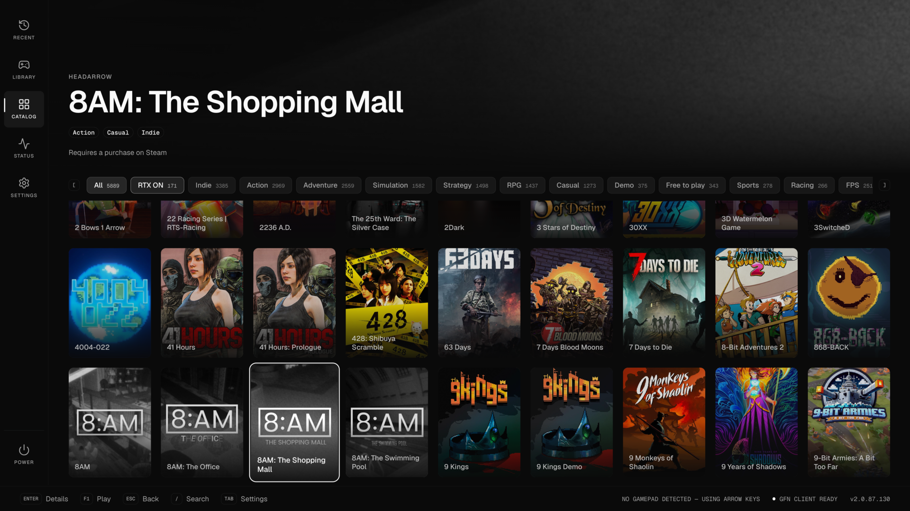

# GFN Launcher

A couch launcher for NVIDIA GeForce NOW. Fullscreen, gamepad-only, starts with your desktop session, and hands games off to the native GeForce NOW client.

Built for the television rather than the desktop: a 10-foot interface you drive from three metres away, where the cover art is the brightest thing on screen and the launcher's own chrome gets out of the way.

Linux only.



The whole GeForce NOW catalogue — 5 889 titles the day this was taken. The ring around one cover is the cursor, and the strip above it is every genre with its count. More views in [docs/screenshots](docs/screenshots).

## Support the project

This launcher is developed on a best-effort basis, in time taken from elsewhere and at my own expense. It is free and always will be, and there is no paid tier waiting behind it.

If it earned a place on your television, a donation is the most direct encouragement to keep working on it and to keep making it better.

<p align="center">
  <a href="https://www.paypal.com/donate/?hosted_button_id=6TJMUEWLPE95Y">
    
  </a>
</p>

<p align="center">
  <a href="https://www.paypal.com/donate/?hosted_button_id=6TJMUEWLPE95Y"><strong>Donate with PayPal</strong></a>
  <br>
  <sub>Or point a phone camera at the code above.</sub>
</p>

## Requirements

- The official **GeForce NOW Flatpak**, `com.nvidia.geforcenow`
- A gamepad — Xbox, PlayStation and 8BitDo pads all report the standard layout
- Any Linux distribution with Flatpak

You do not need a GeForce NOW account to browse or to launch: the deep link goes to the local client, so **launching games works signed out**. Signing in adds your library and ownership.

## Install

**You already have Flatpak.** GeForce NOW on Linux *is* a Flatpak, so the one prerequisite for the recommended install is the same thing this launcher requires anyway. Nothing new to adopt.

### Flatpak — recommended, any distribution, automatic updates

```bash
flatpak install flathub io.github.robertotucci.GfnLauncher
flatpak run io.github.robertotucci.GfnLauncher
```

> Flathub submission is in progress. Until it lands, use the bundle below — it installs the same build.

### Flatpak bundle — from the Releases page

Works on every distribution, offline, and needs no remote. It does **not** update itself: you download a new bundle each release.

```bash
flatpak install --user ./GfnLauncher-<version>.flatpak
```

### AppImage — if you would rather not use Flatpak at all

```bash
chmod +x GFN-Launcher-<version>.AppImage
./GFN-Launcher-<version>.AppImage
```

### .deb — Debian and Ubuntu

```bash
sudo apt install ./gfn-launcher_<version>_amd64.deb
```

All artefacts are attached to each [release](https://github.com/robertotucci/gfnlauncher/releases). x86_64 only, because the GeForce NOW client is x86_64 only — an arm64 build would be a launcher that cannot launch anything.

## Controls

| Button | Action |
| --- | --- |
| Left stick / D-pad | Move |
| **A** | Details — opens the panel, with the cursor already on **Play** |
| **B** | Back |
| **X** | Search — or, in the details panel, mark as owned |
| **Y** | Settings |
| **☰** Menu / Options / Start | Play immediately |
| **LB** / **RB** | Step through the set in front of you — genres on the grid, screenshots in the viewer |

Two presses launch a game, both on A: A opens the details panel with **Play** already focused, A again plays it. ☰ skips the panel when you already know what you want.

A keyboard mirrors the pad, mostly for development:

| Key | Action |
| --- | --- |
| Arrow keys | Move |
| `Enter` | A |
| `Escape` | B |
| `/` | Search |
| `Tab` | Settings |
| `F1` | ☰ (play) |
| `[` `]` | LB / RB |

`F1` and the brackets rather than letters, and `Escape` rather than `Backspace`: the search overlay types letters and deletes with Backspace, and a key cannot mean two things.

Search is driven by an on-screen alphabetical keyboard — A–Z in a grid, because on a pad you scan for a letter rather than reach for it.

The footer legend always describes the controller in your hands. Unplug the pad and it switches to keycaps; plug in a PlayStation pad and A becomes ✕.

## What is in it

- **Grid** of the whole GeForce NOW catalog (~5 900 titles), with genre filtering and an RTX filter
- **Library** view of what you own, once signed in
- **Recent** — what you played, in the order you played it
- **Search**, server-side, driven from the on-screen keyboard
- **Details panel** — description, screenshots, supported controls, subscription tier, and store chips for picking which store's edition launches
- **Status** — GeForce NOW service health, opening with *your* datacenter rather than a list of 76. Read from the client's own routing configuration on this disk, so it needs no account and works offline
- **Settings** — sign-in, library sync, accent colour, interface scale (75–175%), fullscreen, autostart, launch mode
- **Power** — back to desktop, sleep, restart, turn off. The launcher is the last thing on screen before the TV goes off

## Signing in

Open **Settings** (Y) and choose **Sign in to GeForce NOW**. NVIDIA's own sign-in page opens in a window the launcher owns; log in as you normally would. The session persists, so this is a one-time step.

Two honest caveats:

- **Sign-in needs a mouse and keyboard.** NVIDIA's login page is not gamepad-navigable. Everything after it is.
- The launcher reads the session off that window and keeps the bearer token in memory only. It is never written to disk.

## Sandbox permissions, and why

The Flatpak asks for more than a typical app, and it is worth saying plainly why. You can inspect the list yourself:

```bash
flatpak info --show-permissions io.github.robertotucci.GfnLauncher
```

| Permission | What needs it |
| --- | --- |
| `--talk-name=org.freedesktop.Flatpak` | Running commands on the host: `flatpak` to launch the GeForce NOW client with a deep link and to stop a running one first, `systemctl` for the power menu, and writing the autostart entry into your real `~/.config/autostart` |
| `--device=all` | Reading the gamepad, and the GPU |
| `--filesystem=~/.var/app/com.nvidia.geforcenow:ro` | Reading which datacenter your client is set to stream from, for the Status screen |
| `--filesystem=…/flatpak/app/com.nvidia.geforcenow:ro` | Reading the GeForce NOW client's own service configuration instead of hardcoding NVIDIA's hostnames |
| `--share=network` | The catalog, sign-in, and the status page |
| `--socket=wayland`, `--socket=fallback-x11`, `--share=ipc` | Drawing a window |
| `--socket=pulseaudio` | Sound, for the web-player fallback |

**`--talk-name=org.freedesktop.Flatpak` is effectively an exit from the sandbox**, and there is no way around it for an app whose entire purpose is to drive another Flatpak. There is no portal for "launch this Flatpak with these arguments" — the deep link is an argv, not a URI scheme — and stopping a running client needs the host too. If that trade is not one you want to make, the AppImage does the same things with no sandbox at all, which is at least honest about it.

It is also the *only* host permission asked for. The autostart entry goes through it rather than through a second `--filesystem=xdg-config/autostart:create`, precisely so there is one door to inspect rather than two.

Every permission can be revoked with [Flatseal](https://flathub.org/apps/com.github.tchx84.Flatseal) or `flatpak override`. Revoke the first one and the launcher will tell you what is missing rather than pretending GeForce NOW is not installed.

## Waking the machine with the pad

Not something the launcher can do — `/sys/bus/usb/devices/*/power/wakeup` is root-owned. It takes one udev rule, written up in [docs/wake-on-gamepad.md](./docs/wake-on-gamepad.md).

## Documentation

- **[ARCHITECTURE.md](./ARCHITECTURE.md)** — how it is built and why, including the constraints worth knowing before changing anything
- **[CONTRIBUTING.md](./CONTRIBUTING.md)** — development setup, conventions, release process
- **[docs/gfn-api.md](./docs/gfn-api.md)** — the GeForce NOW client API: endpoints, GraphQL documents, the launch deep link, and how each fact was derived

## Relationship to NVIDIA

None. This is an unofficial, independent project, not affiliated with or endorsed by NVIDIA. It does not stream anything itself and it does not reimplement the client: it browses the catalog and hands a deep link to the GeForce NOW client you already installed. "GeForce NOW", "NVIDIA" and "RTX" are trademarks of NVIDIA Corporation.

The API notes in `docs/gfn-api.md` were derived by observing a legally installed client on the author's own machine, and are published so that the code here can be read and audited rather than taken on trust.

## Licence

Copyright (C) 2026 Roberto Tucci.

Released under the [GNU Affero General Public License v3.0](./LICENSE). You may use, study, modify and redistribute it; if you distribute a modified version — or run one as a network service — you must release your changes under the same licence.
